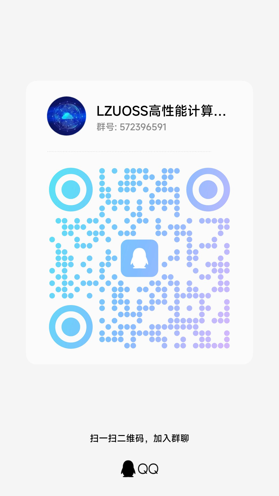

# LzuOssHPC 超算团队选拔题目

兰州大学 LzuOssHPC 超算团队及 ASC 24 选拔题目。

根据做题情况，我们会发放一定的奖品，奖品内容我们会在提交时间截至后根据提交情况确定。

## 题目

我们分为科学计算和人工智能两个赛题，只需选取一个赛道的题做就可以。一些题目为扩展、可选，为加深理解而出。

每个赛道我们不要求完成全部要求，做多少是多少，可以根据自己感兴趣的方向选择几道去做就行，可以使用各种方式去学习（包括类似 ChatGPT 的人工智能）。我们的门槛不高，欢迎任何对这个领域感兴趣并有精力去学习的同学来到我们的团队，我们会根据报告判定你是否具备一定的兴趣以及必要的基础能力。

- [写在前面](./problem-sets/first-of-all.md)
- 科学计算赛道题目：
- - [科学计算1](./problem-sets/sci-1.md)
- - [科学计算2](./problem-sets/sci-2.md)
- - [科学计算3](./problem-sets/sci-3.md)
- - [科学计算4](./problem-sets/sci-4.md)
- - [科学计算拓展：运维](./problem-sets/ops.md)
- 人工智能赛道题目：
- - [人工智能](./problem-sets/ai.md)

## 报告格式

推荐使用 Markdown 或者 LaTeX 编写，生成 PDF 文件。LaTeX 推荐使用 overleaf 或者配置 vscode 写作环境。如果你的 word 写得相当规范也可以接受（最好还是生成 PDF 文件）。

报告以及相关代码、数据打包压缩后，命名为 `姓名-年级-学院-专业-联系方式（QQ或者微信）`，在 **12 月 12 号** 前，发送至邮箱：[hpcclass@lzu.edu.cn](mailto:hpcclass@lzu.edu.cn)

若你是外校学生或社会人士（谢谢您对我们团队的支持❤️），请附带上邮寄信息，方便后面我们奖品的发放。

## 交流群

## Thanks

感谢兰州大学超算中心、兰州大学开源社区的大力支持。

出题人：[RoyenHeart](https://github.com/royenheart)、[Season111](https://github.com/Season111)