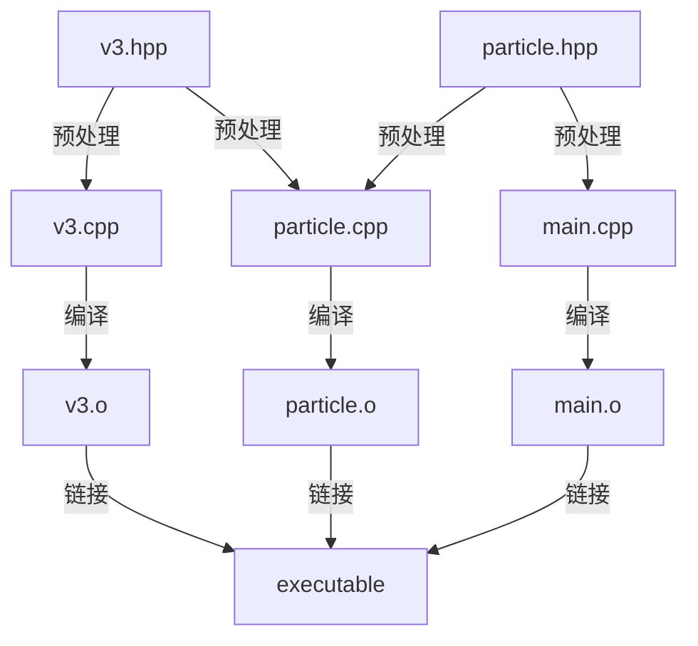

# 关于使用

`./compile.sh help` 查看使用帮助。

## step2

step2 文件夹中文件的依赖关系

```mermaid
graph TD
H1[v3.hpp] --预处理--> C1[v3.cpp]
H1 --预处理--> C2[particle.cpp]
H2[particle.hpp] --预处理--> C2
H2 --预处理--> C3[main.cpp]
C1 --编译--> L1[v3.o]
C2 --编译--> L2[particle.o]
C3 --编译--> L3[main.o]
L1 --链接--> E[executable]
L2 --链接--> E
L3 --链接--> E
```