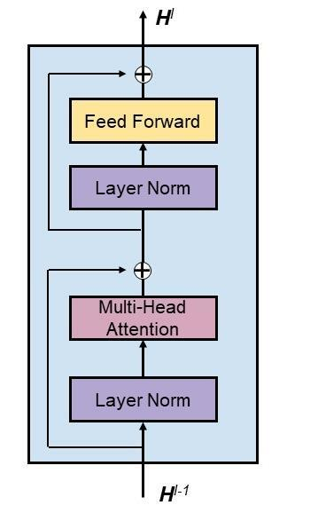

# 人工智能部分纳新

## 基础题目

1. BPNN 实现逻辑操作和函数拟合，要求不调用 tensorflow，pytorch 等深度学习库，尽可能自己实现。

2. 学习 VGG,  GoogleNet(Inception), ResNet 模型结构代码。分别训练 VGG,  GoogleNet(Inception), ResNet 模型用于 cifar100 数据集分类，尝试调整模型结构和超参数提高预测精度，给出三种模型的实验结果并进行对比分析（测试精度，训练时间），之后复现当前 cifar100 数据集上的 sota 模型与上述模型进行对比，用作图工具尽可能直观的展示出 sota 模型的优越性。

## 进阶题目：我的中文语言“大”模型

#### 简介

​GPT-3 是一种用于自然语言处理（NLP）的具有 1750 亿个参数的大型语言模型(LM)，它引发了 AI 的全新趋势。GPT-3 可广泛用于多种 NLP 应用，例如阅读理解、问答、文本演绎等。此后，发布了大量大型LM 。

​训练具有数十亿或数万亿参数的大型语言模型非常困难，因为不仅需要大量的计算资源，而且还需要复杂的训练方法来处理如此庞大的模型参数，这可能超出现代处理器的内存限制。所以应该使用一些特殊的训练方法，比如模型并行和管道并行。

​Yuan1.0 是最大的单例汉语模型之一。它在一个新的 5TB 高质量文本中文数据集上进行训练，该数据集是从互联网的 850TB 原始数据中提取的。元 1.0 的架构是通过将其内在模型结构与严重影响大规模分布式训练性能的关键因素相结合而设计的。Yuan1.0 在一个有 2128 个 GPU 的集群上训练了大约 16 天。训练期间实际稳定表现达到了理论峰值的 $45\%$ 。Yuan1.0 的源代码可以从 https://github.com/Shawn-Inspur/Yuan-1.0 下载。

#### 模型要求

我们希望您可以自行配置好环境后，使用源代码中的 `/Yuan-1.0/src/pretrain_yuan_13B.sh` 脚本经过部分参数修改后成功训练出一个属于你的 **“AI大模型”** 。

模型参数要求如下：

| **Model** | hidden size(d) | **attention-heads** | **Layers(L)** | Parameters(Million) | Sequence length(n) | **Train tokens** **(Million)** |
| --------- | -------------- | ------------------- | ------------- | ------------------- | ------------------ | ------------------------------ |
| 2M        | 37             | 20                  | 4             | 2M                  | 24                 | 5                              |

​模型的 loss 计算公式如下所示，Loss 便是 loss 计算函数, $n$ 是训练的 sequence length, $E$ 是 word 嵌入矩阵，以及 $\boldsymbol{P}$ 是位置嵌入矩阵, $\mathrm{L}$ 是 transformer blocks 的数目，该值越低则表示模型精度越高。

<!-- $$
\begin{gather}
\text{Loss} = \sum_{k=1}^{n} - \log P \left(x_{k} \mid x_{1}, x_{2}, \ldots, x_{k-1} \right) \\
\textbf{H}^{0} = \textbf{E} + \textbf{P} \\
\textbf{H}^{l} = \text{Transformer block} \left(\textbf{H}^{l-1} \right), 1 \ll l \ll L \\
P \left(x_{k} \mid x_{1}, x_{2}, \ldots, x_{k-1} \right) = \text{softmax} \left(W_{v} \textbf{H}_{k}^{L} \right)\bigg|_{x_{k}} \\
\end{gather}
$$ -->

Transformer_block 的架构如下图所示：

FFN 块中有两层，权重 $W_1 \in R^{d \times 4d}$ 和 $W_2 \in R^{4d \times d}$ 。

$$
\text{FFN} (x) = \max \left(0, x W_1 + b_1 \right) W_2 + b_2
$$

#### 数据集

数据集如要使用下载链接如下：

- 百度云盘: https://pan.baidu.com/s/1sTnhTDzech79gACwYgF1bg?pwd=ASC1 (extract code: ASC1)

- Microsoft OneDrive: https://1drv.ms/f/s!Ar_0HIDyftZTsFkbM8eQFtquk4ZH

数据集因为过于庞大，因此只需下载 `001.txt` 完成本次训练任务即可。

#### 基本要求

**结果精度要求：**

由于各位可用的计算资源和时间有限，我们只要求参与者在最短的时间内完成5百万个 train-token 的训练，并达到小于7.0的 loss 值。如果最终的 loss 值大于7.0，说明模型训练过程不能收敛，提交的结果无效。

**文档编写要求：**

​请使用 `LaTeX` 或 `Markdown` 编写整个文档。简单介绍您是如何进行环境配置的，过程中遇到的一些麻烦以及是如何解决的，尽可能详细记录整个过程。

**其他要求：**

​除了需要提交文档外，我们还希望您可以将如下文件提交：

| **文件夹名称**   | **内容**                 |
| ---------------- | ------------------------ |
| MYLM             | 根目录                   |
| MYLM/Log         | 预训练日志文件           |
| MYLM/tensorboard | tensorboard日志文件      |
| MYLM/model       | 语言模型预训练脚本源代码 |

### 进阶题目（100，拓展）：训练中文语言大模型——“Yuan”

要求使用各种优化方式，使得模型在达到以上基本要求的条件上，需要更快的完成预训练任务。

可以参考的优化方式如下所示：

Deepspeed：

- `Zero` : https://www.deepspeed.ai/tutorials/zero/

- `spare attention` : https://www.deepspeed.ai/tutorials/sparse-attention/

除此外模型参数量也发生一些变化，具体变动如下所示：

| **Model** | hidden size(d) | **attention-heads** | **Layers(L)** | Parameters(Billion) | Sequence length(n) | **Train tokens** **(Billion)** |
| --------- | -------------- | ------------------- | ------------- | ------------------- | ------------------ | ------------------------------ |
| 4.7B      | 3072           | 20                  | 40            | 4.7                 | 2048               | 1                              |
